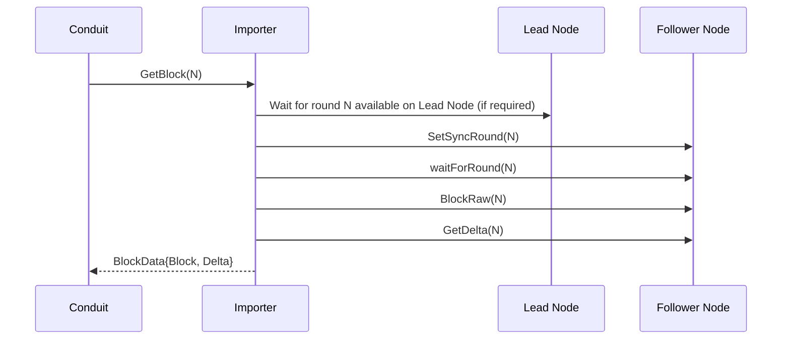
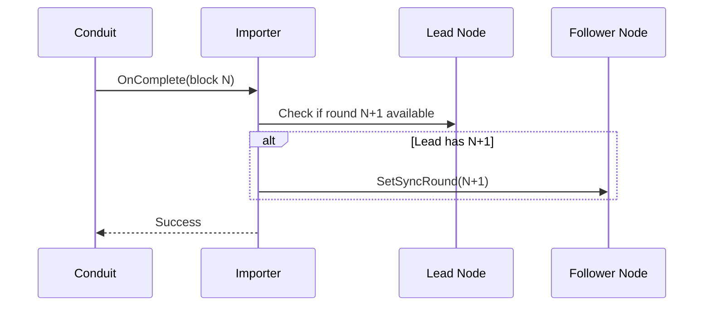

# Conduit LocalNet Importer

A standalone [Conduit](https://github.com/algorand/conduit) importer plugin optimized for LocalNet using lead-based synchronization.

## Overview

The AlgoKit LocalNet environment leverages the algod DevMode feature (by default), which produces blocks as soon as transaction are available in the mempool. Additionally if transactions are not available, no blocks are produced. This behaviour is incredibly useful for fast feedback when developing and testing, however is different to a regular network.

This difference in behaviour causes syncing delays into the indexer instance, as block production isn't predictable. This creates automated test timing determinism issues and ultimately slows down tests that depend on transactions being available in the indexer.

To ensure a predictable indexer syncing experience, this LocalNet specific algod importer plugin was created, which features:

- **Lead-based sync**: Tracks block production on the lead (primary) algod node to determine when to sync, ensuring no sync delays.
- **Optimized for LocalNet DevMode**: Designed for the default LocalNet configuration, which has a high block production throughput. Whilst optimised for DevMode, it still works fine in non DevMode.
- **Follower mode only**: Operates exclusively in follower mode with state deltas enabled.

## How It Works

The importer coordinates a lead node (producing blocks) and a follower node (serving Conduit):

### GetBlock Flow



### OnComplete Flow



## Configuration

The LocalNet importer requires two algod nodes:

1. **Lead node**: The primary node that generates blocks
2. **Follower node**: A follower-mode node that syncs to the lead

### Required Configuration

- `lead-node-url`: URL of the lead algod node (e.g., `http://localhost:8080`)
- `follower-node-url`: URL of the follower algod node (e.g., `http://localhost:8081`)

### Token Configuration (Optional)

Tokens are optional. If your nodes require authentication, you have three options:

1. **Use same token for both nodes** (simplest):

   - Set `token`: Used for both lead and follower nodes

2. **Use separate tokens**:

   - Set `follower-node-token`: Used for follower node
   - Set `lead-node-token`: Used for lead node

3. **Mix of default and specific**:
   - Set `token` as default
   - Optionally override with `follower-node-token` and/or `lead-node-token`

### Example Configuration

Initialize conduit with the LocalNet importer:

```bash
./conduit init --importer localnet_algod -d conduit_data
```

Edit `conduit_data/conduit.yml` and configure the importer section:

```yaml
importer:
  name: localnet_algod
  config:
    lead-node-url: "http://localhost:8080"
    follower-node-url: "http://localhost:8081"
    token: "your-token"
```

Start conduit:

```bash
./conduit -d conduit_data
```
